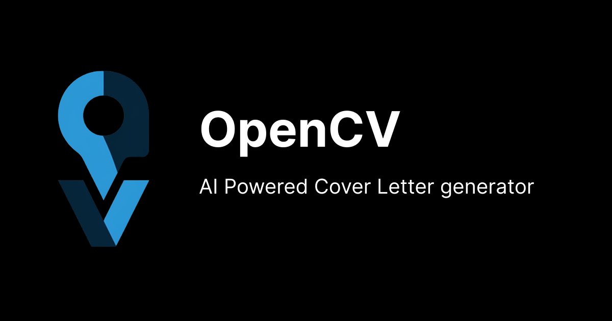
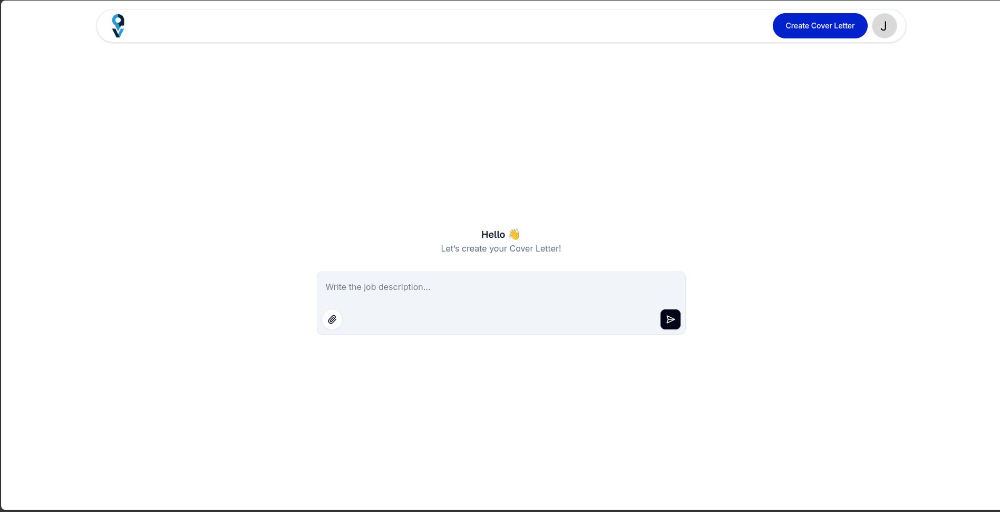
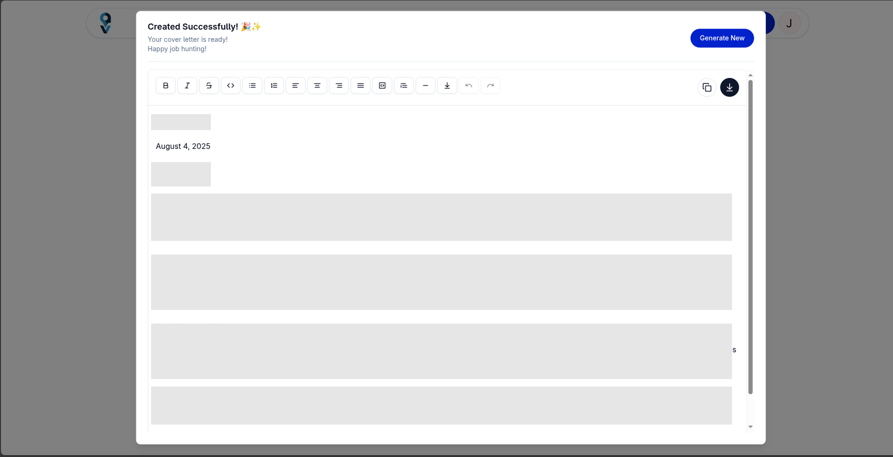

# OpenCV
### 🚀 OpenCV is a smart job application assistant that helps you create personalized cover letters in seconds. Powered by Gemini AI, it analyzes your resume and job descriptions to highlight your most relevant qualifications.
[Try it here](https://opencv.aljimsondev.site/)

## FEATURES

 - ✨ AI-Powered Tailoring – Generates unique cover letters based on your resume and job description.
 - 📄 Minimal Input – Just provide your name, email, resume, and job details.
 - ⚡ Quick & Easy – Get polished cover letters ready for submission in minutes.
 - 🔒 Privacy-Focused – Your data is secure and never shared without consent.

## TECH STACK
- Frontend: Next.js / React
- Authentication & Database: Firebase
- AI Integration: Gemini AI
- Styling: Tailwind CSS / CSS
- Backend: Next.js API
- Deployment: Vercel

## Usage
  1. Upload your resume (PDF/DOCX) or paste your work experience.
  2. Enter the job description you’re applying for.
  3. Generate & customize your AI-powered cover letter.
  4. Download or copy the final version for your application.

## Support & Contact
📧 Email: aljimson.megrino@gmail.com
🐛 Report Issues: [GitHub Issues](https://github.com/aljimsondev/open-cv/issues)

Made with ❤️ by aljimsondev. Happy job hunting! 🎯

## Screenshots
 #### Create Page
   

 #### Create Page
   

 

